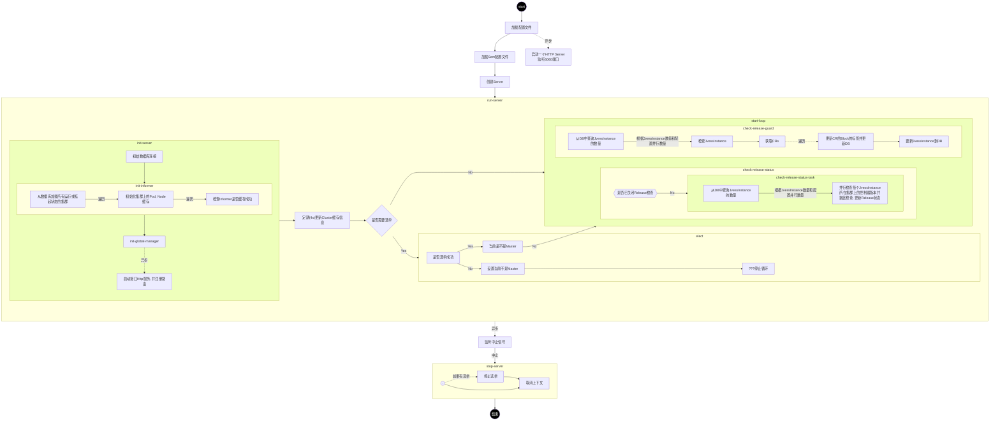

# mermaid-test

## test

```mermaid
graph TD
    s((start)):::startend --> load-conf[加载配置文件]
    load-conf --> load-sem-conf[加载Sem配置文件] --> new-server[创建Server] --> run-server[运行Server] -. 异步 .-> watch-sig[监听中止信号] -- 中止 --> stop-server[停止Server] --> over((结束)):::startend
    load-conf -. 异步 .-> http-server["启动一个HTTP Server
    监听6060端口"]

    subgraph "run-server"
        init-server[初始化] --> refresh-cluster-informer["定期(4s)更新Cluster缓存信息"] --> elect_or_not{是否需要选举}
        elect_or_not -- Yes --> elect[选举]
        elect_or_not -- No --> start-loop[开启循环]

        subgraph "init-server"
            connect-db[初始数据库连接] --> init-informer[初始Cluster缓存池] --> init-global-manager -. 异步 .-> start-http-server[启动接口Http服务, 并注册路由]
        end
    end

    subgraph "elect"
        if-elect-master[是否选举成功] -- Yes --> is-master[当前是不是Master] -- No --> start-loop
        if-elect-master -- No --> set-master-false[设置当前不是Master] --> stop-loop[???停止循环]
    end

    subgraph "init-informer"
        load-cluster-db[从数据库加载所有运行或挂起状态的集群] -- 遍历 --> init-cluster-informer[初始化集群上的Pod, Node缓存] -- 遍历 --> check-informer-synced[检查Informer是否缓存成功]
    end

    subgraph "start-loop"
        check-release-status[定时检查Release状态]
        check-release-guard[定时检查Release保护状态]
    end

    subgraph "check-release-status"
        if-check-release-off{{是否已关闭Release检查}} -- No --> check-release-status-task[检查每个集群的状态]
    end

    subgraph "check-release-guard"
        load-instance-count-from-db1[从DB中查询JvessInstance的数量] -- 根据JvessInstance数量和配置并行数量 --> check-instance[检查JvessInstance]
        check-instance  --> get-cr-list[获取CRs] -.遍历.-> update-instance-block[更新CR的Block的标签并更新DB] --> update-instance-db[更新JvessInstance到DB]
    end

    subgraph "check-release-status-task"
        load-instance-count-from-db[从DB中查询JvessInstance的数量] -- 根据JvessInstance数量和配置并行数量 --> check-controller-version-concurrent[并行检查每个JvessInstance所在集群上的控制器版本并据此检查, 更新Release状态]
    end

    subgraph "stop-server"
        s1((.))
        s1 -. 如果有选举 .-> stop-elect[停止选举] --> cancel-ctx[取消上下文]
        s1 --> cancel-ctx
    end

    classDef startend fill:#000000,color:#FFFFFF
    classDef subgraphStyle fill:#EEFFBB

    class init-server subgraphStyle
    class start-loop subgraphStyle
    class check-release-status-task subgraphStyle
```
